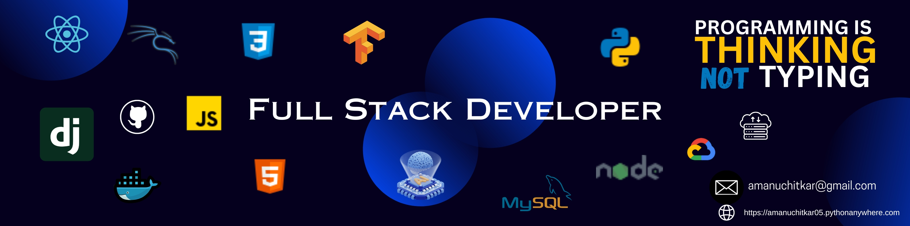

<h1 align="center">Hi 👋, I'm Aman Uchitkar</h1>
<h3 align="center">A Passionate Full Stack Developer from India</h3>

  

- 🌱 Currently learning **Backend Development with Python and Django**  
- 📫 Reach me at **amanuchitkar@gmail.com**  
- 🌐 Personal Portfolio: [Visit Here](https://amanuchitkar05.pythonanywhere.com/)  

---

<h3 align="left">🔗 Connect with Me</h3>

  
  
  
  

---

<h3 align="left">💻 Tech Stack</h3>

  
  
  
  
  
  
  
  
  
  
  
  
  
  
  

---

<h3 align="left">📊 GitHub Stats</h3>

  
<!--    -->
  
  

---

<h3 align="left">🏆 GitHub Profile Trophy</h3>

  

---

<h3 align="left">📈 Contribution Graph</h3>

  

---

<h3 align="center">✨ Thank you for visiting my profile!</h3>
