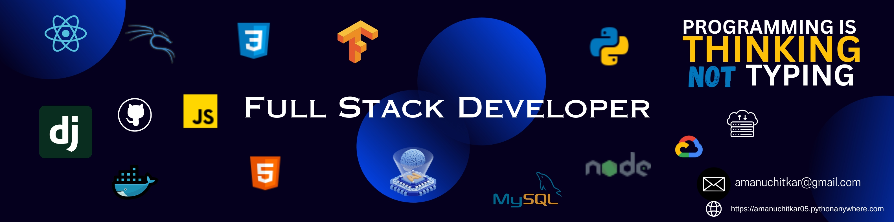
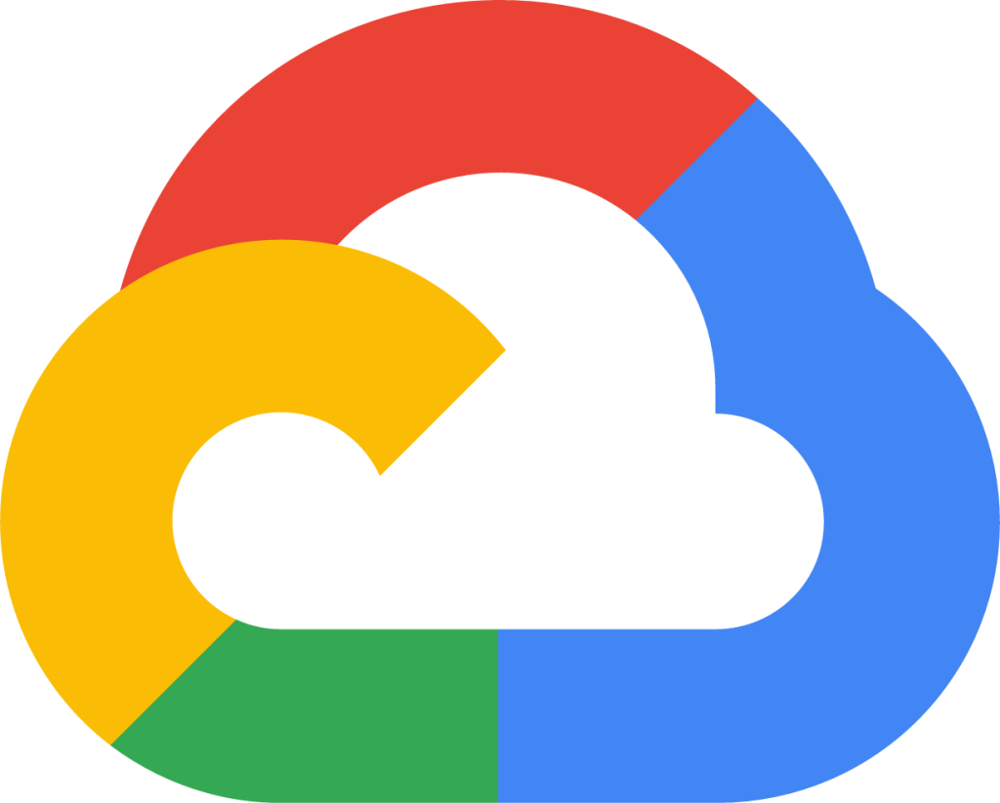

<h1 align="center">Hi 👋, I'm Aman Uchitkar</h1>
<h3 align="center">Founder & CTO @ MentorSarthi · Full-Stack Developer & Ethical Hacker</h3>

  

- 🚀 **Founder, CTO & Developer** at [MentorSarthi](https://amanuchitkar.in) — a flagship product under Enorvia Global *(Jan 2025 – Present)*
- 🎓 Pursuing **B.E. in Electronics & Telecommunication** from [DBATU](https://dbatu.ac.in)
- 🔐 Passionate about **Full-Stack Development**, **Ethical Hacking & Cybersecurity**
- 🛠️ **Technical Lead** at EDC DBATU *(Nov 2024 – Present)*
- ☁️ **Google Arcade Facilitator** — Google Cloud Skills Boost *(Apr 2025 – Jun 2025)*
- 🌐 **Web Dev Coordinator** — Google Developer Students Club (GDSC) DBATU *(Jun 2023 – Jun 2024)*
- 🏆 **Participant** — Smart India Hackathon (SIH) 2024 — National Level *(Problem Statement: Post India)*
- 🏆 **Participant** — Smart India Hackathon (SIH) 2025 — National Level *(Problem Statement: MathWorks)*
- 📫 Reach me at **amanuchitkar@gmail.com** · 📞 +91 70583 76553
- 🌐 Portfolio: [amanuchitkar.in](https://amanuchitkar.in) · 📄 [View Resume](https://drive.google.com/file/d/1Y4lpKkXeOr_5POdlMw2V1Mgg5gyDzbA6/view?usp=drive_link)

---

<h3 align="left">🔗 Connect with Me</h3>

  
  
  
  

---

<h3 align="left">💻 Tech Stack</h3>

  
  
  
  
  
  
  
  
  
  
  
  
  
  
  

---

<h3 align="left">📊 GitHub Stats</h3>

<!-- Row 1: Profile Details — full width -->

  

<!-- Row 2: Stats (left) + Top Languages by Repo (right) -->

  
  

<!-- Row 3: Top Languages by Commit (left) + Productive Time (right) -->

  
  

<!-- Row 4: GitHub Streak — centered -->

  

---

<h3 align="left">🏆 Achievements & Highlights</h3>

> 🎯 **GitHub Achievements** are natively displayed on my GitHub profile — visit [github.com/amanuchitkar](https://github.com/amanuchitkar) to see earned badges like *Pull Shark*, *Quickdraw*, and more!

  
  

---

<h3 align="left">📈 Contribution Graph</h3>

  

---

<h3 align="center">✨ Thank you for visiting my profile!</h3>
